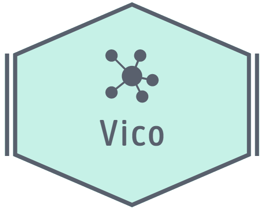

# Vico (work in progress)

> Vico is an Entity-Component-System (ECS) based co-simulation framework




[](https://opensource.org/licenses/MIT)
[](https://github.com/NTNU-IHB/Vico/issues) 


[](https://gitter.im/NTNU-IHB/Vico?utm_source=badge&utm_medium=badge&utm_campaign=pr-badge)

Vico is a generic co-simulation framework running on the JVM that takes advantage of the ECS software architecture popularized by game engines. 
A simulation object is known as an _entity_, which is basically a collection of _components_. A component is just state, with no behavior.
Behaviour is added to the simulation through so called _systems_ that acts on entities within a certain _family_. 
The type of components held by a given entity decides which family it belongs to. 
Entities, components and systems may be added and removed from the engine at any time, thus family relationships, 
what an entity represents and which entities a system acts on is highly dynamic. 

#### FMI & SSP support

Support for FMI 1.0 & 2.0 for co-simulation and SSP 1.0 is provided by the __fmi__ module. 

More specifically this module adds a _SlaveSystem_ that represents a collection of fmus to be simulated together. The
SlaveSystem requires an instance of a class implementing the interface _MasterAlgorithm_, which represents an FMI master
algorithm. A ready to use _FixedStepMaster_ is provided by the module.

Distributed execution of FMUs is possible by means of [FMU-proxy](https://github.com/NTNU-IHB/FMU-proxy).

#### Time-series and XY charts

Support for plotting is provided by the __chart__ module.

#### 3D rendering

Generic 3D visualization components are provided by the __render-components__ module.
An implementation of a rendering system, relying on JMonkeyEngine, is provided by the __jme-renderer__ module.

#### Physics

Generic physics components are provided by the __physics-components__ module.
An implementation of a physics engine, relying on Bullet, is provided by the __bullet-physics__ module. 

### Command line interface
````bash
Usage: vico [-h] [COMMAND]
  -h, --help   display a help message
Commands:
  eval Interpret kotlin script using kts.
  simulate-fmu  Simulate a single FMU.
  simulate-ssp  Simulate a co-simulation system described using SSP.
````
To see the input arguments for the sub-commands, run the respective command providing no arguments.

### Scripting

[kts](https://github.com/markaren/kts) can be used to run arbitrary Kotlin code with maven dependencies, which means
that you may use Vico as a dependency in your script. kts is bundled with the vico CLI for convenience (`vico eval`).

### How to build

Simple execute `./gradlew build` in a shell. The CLI will be located under `cli/build/install`. <br>

### Development

As Vico is written in Kotlin, [IntelliJ IDEA](https://www.jetbrains.com/idea/) is the recommended IDE for development.


> Want to simplify creation of SSP archives? Check out [sspgen](https://github.com/NTNU-IHB/sspgen) <br>
> Want to develop FMUs in Java? Check out [FMI4j](https://github.com/NTNU-IHB/FMI4j) <br>
> Want to develop FMUs in Python? Check out [PythonFMU](https://github.com/NTNU-IHB/PythonFMU) <br>
> Want to distrubute your FMUs? Check out [FMU-proxy](https://github.com/NTNU-IHB/FMU-proxy) <br>

